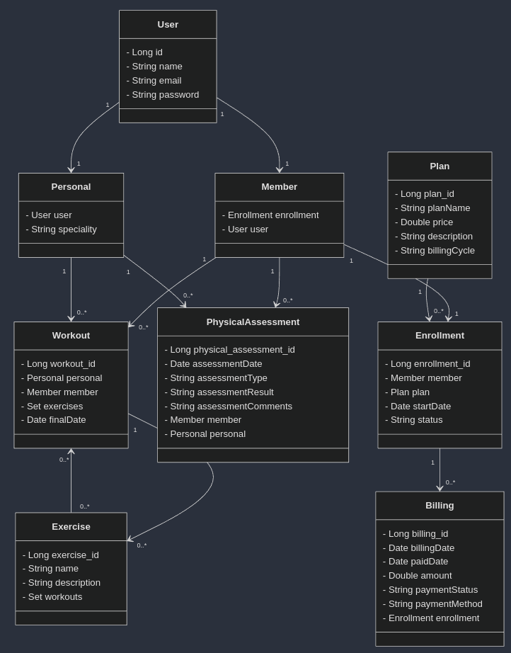
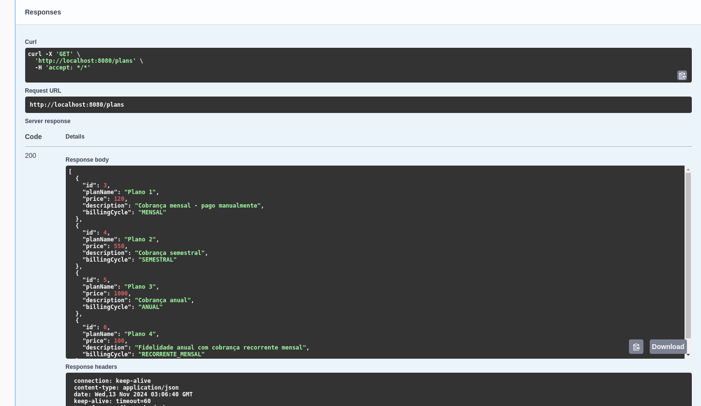
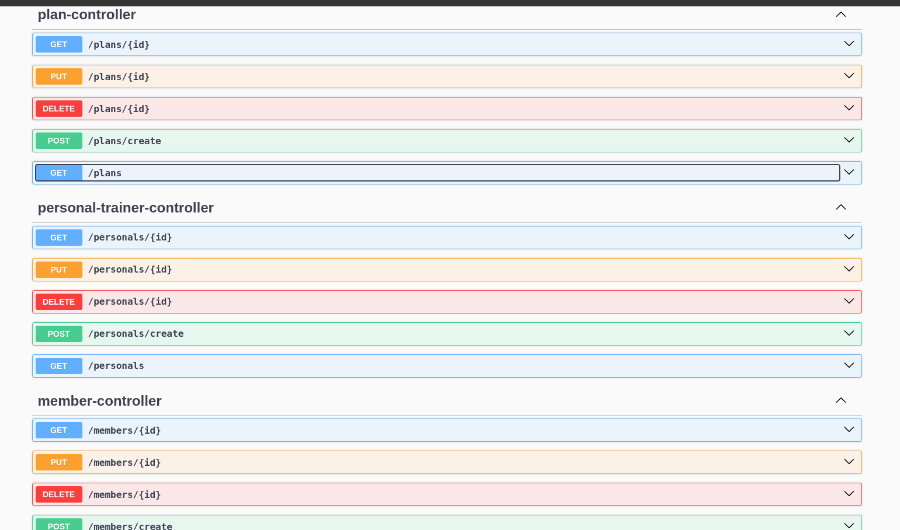

# Gym Management API

### Table of Contents
- [About the Project](#about-the-project)
- [Features](#features)
- [Technologies Used](#technologies-used)
- [Setup and Execution](#setup-and-execution)
- [Diagrams and Documentation](#diagrams-and-documentation)

---

## About the Project

This project is a **simple API for managing small gyms**, designed to simplify the daily operations of gyms through a robust, user-friendly, and well-documented platform. With this API, it is possible to register students and personal trainers, create physical assessments, generate personalized workouts, and manage basic billing.

The API was developed as the final project for the Spring course at DIO, providing a comprehensive structure for essential gym operations.

---

## Features

1. **Student and Personal Trainer Registration**:
   - Allows detailed information of students and personal trainers to ensure personalized management.

2. **Physical Assessments**:
   - Creation and storage of physical assessments, with a data history to track the progress of each student.

3. **Personalized Workout Generation**:
   - Assignment of personalized workouts to students based on their needs and trainer recommendations.

4. **Basic Billing Control**:
   - Recording billing details with payment status and methods, allowing basic financial control for the gym.

---

## Technologies Used

This project was developed with modern, efficient technologies for back-end, database, and documentation:

- **Spring Boot**: Main framework for building the API.
- **Springdoc**: For detailed, automated API documentation.
- **Lombok**: To reduce boilerplate code.
- **Spring JPA**: Data mapping with PostgreSQL.
- **Spring Web**: For constructing and exposing REST endpoints.
- **Mermaid**: For visual documentation diagrams.
- **PostgreSQL**: Relational database.
- **Docker**: Isolated development environment.

---

## Setup and Execution

To run the API in your local environment:

1. Clone the repository and navigate to the project folder.
2. Install the dependencies using Maven or Gradle.
3. Set up the PostgreSQL database locally, or use a Docker container according to your environment.
4. Run the following command to start the server:

   ./mvnw spring-boot:run

5. The API will be accessible at `http://localhost:8080`, with documentation available at `http://localhost:8080/swagger-ui.html`.

---

## Diagrams and Documentation

### Class Diagram

Below is the class diagram of the API, detailing the relationships between the main entities:



### API Documentation Preview

The API is documented using **Springdoc** and is available through an intuitive Swagger interface. Below is a preview of the documentation:




---


# PTBR / API de Gerenciamento de Academia

### Sumário
- [Sobre o Projeto](#sobre-o-projeto)
- [Funcionalidades](#funcionalidades)
- [Tecnologias Utilizadas](#tecnologias-utilizadas)
- [Configuração e Execução](#configuração-e-execução)
- [Diagramas e Documentação](#diagramas-e-documentação)

---

## Sobre o Projeto

Este projeto é uma **API para o gerenciamento de academias pequenas**, projetada para simplificar o dia a dia de academias através de uma plataforma robusta, de fácil uso e documentada. Com esta API, é possível cadastrar alunos e personal trainers, criar avaliações físicas, gerar treinos personalizados e controlar cobranças básicas.

A API foi desenvolvida como parte do projeto final do curso de Spring na DIO, atendendo a uma estrutura completa para operações essenciais de uma academia.

---

## Funcionalidades

1. **Cadastro de Alunos e Personal Trainers**:
    - Permite registrar informações detalhadas de alunos e personal trainers para garantir a personalização e a gestão eficiente.

2. **Avaliações Físicas**:
    - Criação e armazenamento de avaliações físicas, com histórico dos dados para acompanhamento da evolução do aluno.

3. **Geração de Treinos Personalizados**:
    - Atribuição de treinos personalizados aos alunos com base em suas necessidades e orientações do personal.

4. **Controle de Cobrança Simples**:
    - Registro de cobranças com status de pagamento e métodos, permitindo um controle financeiro básico da academia.

---

## Tecnologias Utilizadas

Este projeto foi desenvolvido com tecnologias modernas e eficientes para back-end, banco de dados e documentação:

- **Spring Boot**: Framework principal para a construção da API.
- **Springdoc**: Para a documentação automatizada e detalhada da API.
- **Lombok**: Redução de código boilerplate.
- **Spring JPA**: Mapeamento de dados com PostgreSQL.
- **Spring Web**: Construção e exposição dos endpoints REST.
- **Mermaid**: Geração de diagramas para documentação visual.
- **PostgreSQL**: Banco de dados relacional.
- **Docker**: Ambiente de desenvolvimento isolado.

---

## Configuração e Execução

Para executar a API em seu ambiente local:

1. **Clone o repositório** e navegue até a pasta do projeto.
2. **Instale as dependências** utilizando o Maven ou o Gradle.
3. Configure o banco de dados PostgreSQL localmente, ou use um contêiner Docker conforme seu ambiente.
4. Rode o comando para iniciar o servidor:

   ```bash
   ./mvnw spring-boot:run
   ```
  
5. A API estará acessível em  ```http://localhost:8080```, com a documentação disponível em  ```http://localhost:8080/swagger-ui.html```.

---
## Diagramas e Documentação

### Diagrama de Classes

Abaixo está o diagrama de classes da API, detalhando as relações entre as principais entidades:


### Prévia da Documentação da API

A API foi documentada utilizando **Springdoc** e está disponível através de uma interface Swagger intuitiva. Abaixo, uma prévia da documentação:


---
